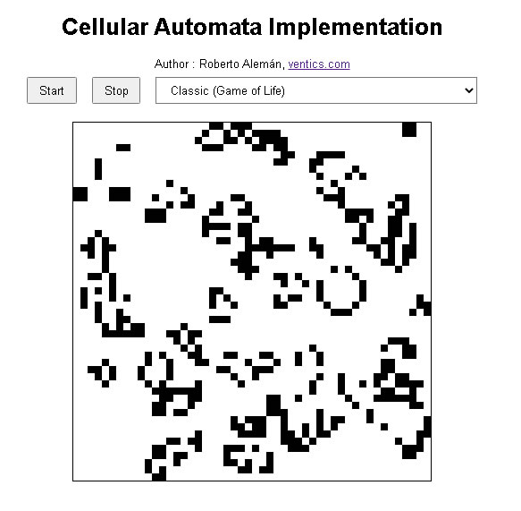

# Cellular-Automata-Implementation
This project implements a variety of cellular automata models using HTML, JavaScript, and an optional CSS file for styling. The implementation includes examples of different types of cellular automata, such as classical (Game of Life), continuous, probabilistic, and more.

